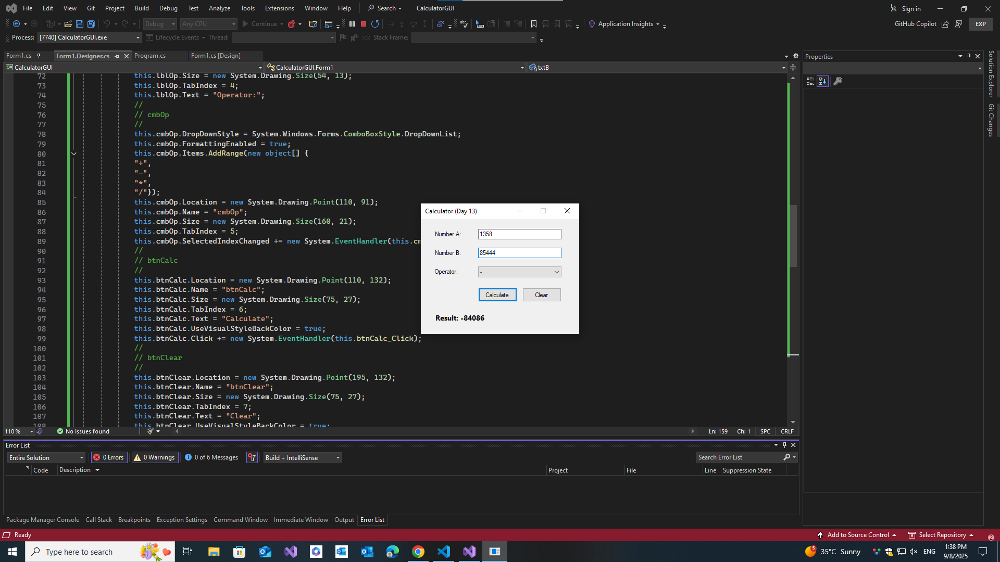

# 🧮 Calculator GUI (C# WinForms App)

This is Day 13 of my 30-Day C# Project-Based Learning Plan.
A simple desktop calculator built with Windows Forms (GUI) in C#.
It supports basic arithmetic operations with input validation and error handling.

----

## 🚀 Features

- Input two numbers (Number A, Number B)

- Select an operator (+, -, *, /)

- Calculate button → shows result

- Clear button → resets everything

- Handles invalid input with MessageBox warnings

- Division by zero → error message

- Result displayed in a bold label

- Optional auto-calc when operator changes

----

## 🛠️ Tech Stack

- C# 7.3

- .NET Framework / .NET WinForms

- Visual Studio IDE

---

## 📸 Screenshots

| 🧮 | 
|--------------|
|  |

---

## 📚 Learning Goals

This project demonstrates:

- Using the WinForms Designer

- Adding and naming controls (TextBox, ComboBox, Button, Label)

- Wiring up events (Click, SelectedIndexChanged)

- Parsing and validating numeric input (double.TryParse)

- Displaying messages with MessageBox

- Building a small desktop app in C#
